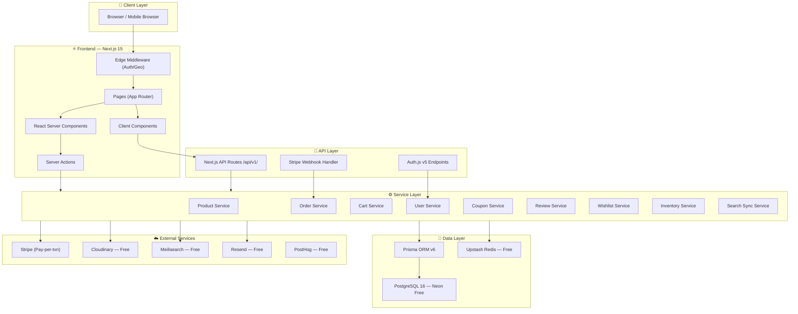
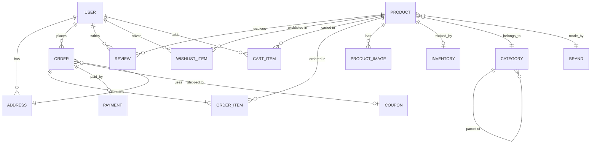

# LUXORA — Luxury Perfume E-Commerce Platform
## Complete System Architecture & Development Roadmap

> **Project Codename:** LUXORA  
> **Version:** 1.1  
> **Date:** 2026-06-17  
> **Author:** Principal System Architect  

---

## MVP Budget Target

| Constraint | Value |
|---|---|
| **Maximum** | $30/month |
| **Preferred** | $0–$15/month |
| **Strategy** | Free tiers everywhere, upgrade only at scale |
| **AI Features** | Deferred until after full deployment |

### MVP Infrastructure Cost Breakdown

| Category | Technology | Tier | Monthly Cost |
|---|---|---|---|
| Frontend | Next.js 15 (App Router) | Open Source | $0 |
| Styling | Tailwind CSS v4 + shadcn/ui | Open Source | $0 |
| Backend | Next.js API Routes + Server Actions | Open Source | $0 |
| Database | PostgreSQL 16 via **Neon** | Free (0.5 GB, 1 project) | $0 |
| ORM | Prisma v6 | Open Source | $0 |
| Auth | Auth.js v5 | Open Source | $0 |
| State | Zustand + TanStack Query | Open Source | $0 |
| Payments | Stripe | Pay-per-txn only (2.9%+30¢) | $0 |
| Images | Cloudinary | Free (25 credits/month) | $0 |
| Hosting | **Vercel** | Hobby → Pro at launch ($20) | $0–$20 |
| CDN | Vercel Edge + Cloudinary CDN | Included | $0 |
| Cache | **Upstash Redis** | Free (10K commands/day) | $0 |
| Search | **Meilisearch Cloud** | Free (100K documents) | $0 |
| Analytics | Vercel Analytics + PostHog | Free tiers | $0 |
| Email | **Resend** | Free (100 emails/day, 3K/month) | $0 |
| Error Monitoring | Sentry | Free (5K events/month) | $0 |
| **TOTAL (Dev/Staging)** | | | **$0/month** |
| **TOTAL (Production Launch)** | | Vercel Pro required | **$20/month** |

### Free Tier Limits & Upgrade Triggers

| Service | Free Limit | Upgrade Trigger | Upgrade Cost |
|---|---|---|---|
| Neon | 0.5 GB storage, 1 branch | >0.5 GB data or need branching | $19/month (Launch) |
| Vercel | Hobby (non-commercial) | Production/commercial launch | $20/month (Pro) |
| Cloudinary | 25 credits (~25K transforms) | >500 product images with heavy transforms | $89/month (Plus) |
| Upstash Redis | 10K commands/day | >10K cache hits/day | $0.2/100K commands |
| Meilisearch | 100K documents | >100K searchable records | $30/month (Build) |
| Resend | 3K emails/month | >3K transactional emails/month | $20/month |
| Sentry | 5K errors/month | >5K error events | $26/month (Team) |
| PostHog | 1M events/month | >1M analytics events | Usage-based |

> **Phase 1 (Development):** $0/month — all free tiers  
> **Phase 2 (Launch):** ~$20/month — Vercel Pro only  
> **Phase 3 (Growth):** ~$60-90/month — add Neon Pro + more Cloudinary as needed  

---

# STEP 1 — Technology Stack Recommendations

## 1.1 Frontend Framework

### ✅ Recommendation: **Next.js 15 (App Router)**

| Aspect | Detail |
|---|---|
| **Why?** | Industry-standard React meta-framework for production e-commerce. Hybrid rendering (SSG/SSR/ISR), built-in image optimization, App Router with React Server Components. Largest developer ecosystem. |
| **Pros** | Hybrid rendering (SSG + ISR + SSR per route), built-in `<Image />` optimization, React Server Components reduce client JS, massive ecosystem & hiring pool, middleware for geo/auth, streaming SSR |
| **Cons** | Vercel-centric optimizations, App Router learning curve |
| **Cost** | Free (MIT License) |
| **Alternatives** | **Remix** — superior data loading but smaller ecosystem. **Nuxt 3** — requires Vue. **SvelteKit** — immature e-commerce ecosystem. |

---

## 1.2 Styling Framework

### ✅ Recommendation: **Tailwind CSS v4 + shadcn/ui**

| Aspect | Detail |
|---|---|
| **Why?** | Utility-first CSS enables pixel-perfect luxury designs without CSS bloat. shadcn/ui provides accessible, production-grade UI primitives (not a dependency — code you own). Dark mode built-in. |
| **Pros** | Zero-runtime CSS, excellent tree-shaking, full design control, shadcn/ui is free (copy-paste), responsive-first utilities |
| **Cons** | Verbose class names, requires Tailwind knowledge |
| **Cost** | Free (MIT) |
| **Alternatives** | **Vanilla CSS** — slower dev velocity. **Chakra UI** — harder to achieve unique luxury aesthetics. **Styled Components** — runtime CSS-in-JS, poor SSR. |

---

## 1.3 Backend Framework

### ✅ Recommendation: **Next.js API Routes + Server Actions (Monolith-first)**

| Aspect | Detail |
|---|---|
| **Why?** | Full-stack TypeScript monolith — shared types, single deployment, zero internal network latency. AI microservice (FastAPI) deferred until after launch. |
| **Pros** | Full-stack TypeScript, shared Prisma types, Server Actions reduce API boilerplate, single deployment unit |
| **Cons** | Long-running tasks need background job infrastructure |
| **Cost** | Free (included with Next.js) |
| **Alternatives** | **Express/Fastify** — unnecessary separation. **NestJS** — too heavy. **tRPC** — adds abstraction. |

---

## 1.4 Database

### ✅ Recommendation: **PostgreSQL 16 (via Neon — Free Tier)**

| Aspect | Detail |
|---|---|
| **Why?** | ACID transactions for payments/inventory. Complex relational queries for analytics. JSONB for flexible product attributes. Neon free tier: 0.5 GB storage, sufficient for MVP with thousands of products. |
| **Pros** | ACID compliance, JOINs, JSONB, full-text search built-in, excellent with Prisma, Neon free tier is generous |
| **Cons** | 0.5 GB free limit (upgrade at ~$19/month when needed) |
| **Cost** | **$0** (Free tier: 0.5 GB, 1 project, 1 compute endpoint) |
| **Alternatives** | **Supabase** — free tier good but ties to ecosystem. **PlanetScale** — MySQL, less feature-rich. **MongoDB** — poor for transactional e-commerce. |

---

## 1.5 ORM

### ✅ Recommendation: **Prisma ORM v6**

| Aspect | Detail |
|---|---|
| **Why?** | Best DX for TypeScript + PostgreSQL. Schema-first, auto-generated types, declarative migrations, visual Studio tool. |
| **Pros** | Auto TypeScript types, declarative schema, Prisma Studio, excellent migrations, middleware support |
| **Cons** | Larger bundle than Drizzle, N+1 queries possible without `include` |
| **Cost** | **$0** (Apache 2.0) |
| **Alternatives** | **Drizzle** — lighter but less mature tooling. **TypeORM** — less type-safe. |

---

## 1.6 Authentication

### ✅ Recommendation: **Auth.js v5 (NextAuth.js)**

| Aspect | Detail |
|---|---|
| **Why?** | Free, full data ownership. No per-MAU costs. Battle-tested. Prisma adapter. Supports OAuth + Credentials. |
| **Pros** | Free, no vendor lock-in, full data control, App Router compatible, supports Google OAuth + credentials |
| **Cons** | You own the security story (password reset, rate limiting) |
| **Cost** | **$0** (ISC License) |
| **Alternatives** | **Clerk** — $25+/month base, per-MAU costs. **Better Auth** — younger community. |

---

## 1.7 State Management

### ✅ Recommendation: **Zustand + TanStack Query**

| Aspect | Detail |
|---|---|
| **Why?** | Zustand for client state (cart, UI). TanStack Query for server state (products, orders) with caching. Both free, both tiny. |
| **Pros** | Zustand: 1KB, no providers, persist middleware. TanStack Query: auto caching, pagination, optimistic updates |
| **Cons** | Two libraries to learn (both simple) |
| **Cost** | **$0** (MIT) |
| **Alternatives** | **Redux Toolkit** — too much boilerplate. **Jotai** — overkill for this. |

---

## 1.8 Payment Gateway

### ✅ Recommendation: **Stripe**

| Aspect | Detail |
|---|---|
| **Why?** | Best developer experience. Embedded Checkout. No monthly fee — pay-per-transaction only. |
| **Pros** | Best docs/SDK, Embedded Checkout, webhook-driven, Radar fraud detection, Apple Pay/Google Pay |
| **Cons** | 2.9% + 30¢ per transaction |
| **Cost** | **$0/month** (transaction fees only) |
| **Alternatives** | **PayPal** — worse DX, ugly checkout. **Square** — weaker online APIs. |

---

## 1.9 Image Storage & Optimization

### ✅ Recommendation: **Cloudinary (Free Tier)**

| Aspect | Detail |
|---|---|
| **Why?** | Automatic format conversion (WebP/AVIF), responsive transformations, CDN delivery. Free tier: 25 credits/month (~25K transformations). Sufficient for MVP product catalog. |
| **Pros** | Auto optimization, URL-based transforms, CDN-delivered, upload widget, AI background removal |
| **Cons** | Free tier limit (upgrade at $89/month if needed) |
| **Cost** | **$0** (Free: 25 credits/month) |
| **Alternatives** | **Uploadthing** — no transforms. **AWS S3** — no built-in optimization. |

---

## 1.10 Hosting & Deployment

### ✅ Recommendation: **Vercel (Hobby → Pro at launch)**

| Aspect | Detail |
|---|---|
| **Why?** | Purpose-built for Next.js. Zero-config deployment, global edge CDN, preview deployments. Hobby plan is free for development. Upgrade to Pro ($20/month) at production launch. |
| **Pros** | Zero-config, global edge network, preview deployments, automatic HTTPS |
| **Cons** | Hobby plan is for non-commercial use. Must upgrade to Pro for production. |
| **Cost** | **$0** (development) → **$20/month** (production) |
| **Alternatives** | **Railway** — $5/month base but less Next.js-optimized. **Netlify** — good free tier but weaker ISR. |

---

## 1.11 CDN

### ✅ Recommendation: **Vercel Edge Network + Cloudinary CDN (both included)**

| Aspect | Detail |
|---|---|
| **Why?** | Vercel's global edge caches static/ISR pages. Cloudinary CDN handles media. No separate CDN needed. |
| **Cost** | **$0** (included with Vercel + Cloudinary) |

---

## 1.12 Caching

### ✅ Recommendation: **Upstash Redis (Free Tier)**

| Aspect | Detail |
|---|---|
| **Why?** | Serverless Redis. Free: 10K commands/day. Rate limiting, cart cache, inventory locks. Works at Vercel Edge. |
| **Pros** | Serverless, global replication, REST API, built-in rate limiting SDK |
| **Cost** | **$0** (Free: 10K commands/day) |
| **Alternatives** | **Vercel KV** — built on Upstash but with markup. |

---

## 1.13 Search Solution

### ✅ Recommendation: **Meilisearch Cloud (Free Tier)**

| Aspect | Detail |
|---|---|
| **Why?** | Instant typo-tolerant search. Free: 100K documents. Built-in faceted filtering. Best DX. |
| **Pros** | Sub-50ms search, typo tolerance, faceted filtering, excellent docs |
| **Cost** | **$0** (Free: 100K documents) |
| **Alternatives** | **PostgreSQL FTS** — fallback if Meilisearch limit hit. **Algolia** — $1+/1K searches (too expensive). |

---

## 1.14 Analytics

### ✅ Recommendation: **Vercel Analytics (free) + PostHog (free tier)**

| Aspect | Detail |
|---|---|
| **Why?** | Vercel Analytics: CWV tracking, zero setup. PostHog: funnels, session replay, feature flags. Both have generous free tiers. |
| **Cost** | **$0** (PostHog Free: 1M events/month) |

---

## 1.15 Email

### ✅ Recommendation: **Resend (Free Tier)**

| Aspect | Detail |
|---|---|
| **Why?** | Modern email API with React Email templates. Free: 100 emails/day (3K/month). Perfect for MVP transactional emails. |
| **Pros** | React Email templates, excellent DX, generous free tier |
| **Cost** | **$0** (Free: 3K emails/month) |
| **Alternatives** | **SendGrid** — free tier exists but worse DX. **Mailgun** — no free tier. |

---

## Technology Stack Summary (MVP)

| Category | Choice | Monthly Cost |
|---|---|---|
| Frontend | Next.js 15 (App Router) | $0 |
| Styling | Tailwind CSS v4 + shadcn/ui | $0 |
| Backend | Next.js API Routes + Server Actions | $0 |
| Database | PostgreSQL 16 via Neon (Free) | $0 |
| ORM | Prisma v6 | $0 |
| Auth | Auth.js v5 | $0 |
| State | Zustand + TanStack Query | $0 |
| Payments | Stripe (per-txn only) | $0 |
| Images | Cloudinary (Free) | $0 |
| Hosting | Vercel Hobby → Pro | $0 → $20 |
| CDN | Vercel Edge + Cloudinary CDN | $0 |
| Cache | Upstash Redis (Free) | $0 |
| Search | Meilisearch Cloud (Free) | $0 |
| Analytics | Vercel Analytics + PostHog (Free) | $0 |
| Email | Resend (Free) | $0 |
| Error Monitoring | Sentry (Free) | $0 |
| **TOTAL (Dev)** | | **$0/month** |
| **TOTAL (Production)** | | **$20/month** |

---

# STEP 2 — Complete System Architecture

## 2.1 Architecture Diagram



## 2.2 Data Flow Explanation

### Request Flow (User browses products)
```
1. Browser → Edge Middleware (check auth cookie, geo-redirect)
2. Middleware → App Router (resolve page route)
3. App Router → React Server Component (fetch data on server)
4. RSC → Product Service → Prisma → PostgreSQL (fetch products)
5. RSC → Redis (check cache, return if hit)
6. Server renders HTML with product data → streams to browser
7. Client hydrates → Zustand initializes cart from localStorage
8. User interaction → TanStack Query fetches more data via API Routes
```

### Checkout Flow (User places order)
```
1. Client → Server Action: createCheckoutSession(cartItems)
2. Server Action → CartService: validate cart items & inventory
3. CartService → InventoryService: lock inventory (Redis distributed lock)
4. Server Action → CouponService: validate & apply discount
5. Server Action → Stripe SDK: create Checkout Session
6. Stripe returns sessionId → Client redirects to embedded checkout
7. User completes payment on-site
8. Stripe → Webhook Handler: payment_intent.succeeded
9. Webhook → OrderService: create order, update inventory
10. OrderService → Resend: send confirmation email
11. OrderService → SearchService: sync order data to Meilisearch
```

### Admin Flow (Admin manages products)
```
1. Admin → Middleware (verify admin role via JWT claim)
2. Admin Dashboard → Server Action: createProduct(formData)
3. Server Action → Cloudinary SDK: upload & optimize images
4. Server Action → ProductService → Prisma → PostgreSQL: save product
5. ProductService → Meilisearch: index new product for search
6. ProductService → Redis: invalidate product cache
7. ISR revalidates product pages automatically
```

---

# STEP 3 — Database Schema

## 3.1 Entity Relationship Diagram



## 3.2 Complete Schema Definition

### Users Table
```sql
CREATE TABLE users (
    id              UUID PRIMARY KEY DEFAULT gen_random_uuid(),
    email           VARCHAR(255) UNIQUE NOT NULL,
    email_verified  TIMESTAMP,
    password_hash   VARCHAR(255),
    name            VARCHAR(255) NOT NULL,
    phone           VARCHAR(20),
    avatar_url      TEXT,
    role            VARCHAR(20) DEFAULT 'CUSTOMER',  -- CUSTOMER | ADMIN | SUPER_ADMIN
    is_active       BOOLEAN DEFAULT true,
    last_login_at   TIMESTAMP,
    created_at      TIMESTAMP DEFAULT NOW(),
    updated_at      TIMESTAMP DEFAULT NOW()
);
CREATE INDEX idx_users_email ON users(email);
CREATE INDEX idx_users_role ON users(role);
```

### Products Table
```sql
CREATE TABLE products (
    id              UUID PRIMARY KEY DEFAULT gen_random_uuid(),
    name            VARCHAR(255) NOT NULL,
    slug            VARCHAR(255) UNIQUE NOT NULL,
    description     TEXT,
    short_desc      VARCHAR(500),
    price           DECIMAL(10,2) NOT NULL,
    compare_price   DECIMAL(10,2),
    cost_price      DECIMAL(10,2),
    sku             VARCHAR(100) UNIQUE NOT NULL,
    barcode         VARCHAR(100),
    weight          DECIMAL(8,2),
    volume          VARCHAR(50),                      -- e.g., "50ml", "100ml"
    category_id     UUID REFERENCES categories(id),
    brand_id        UUID REFERENCES brands(id),
    scent_notes     JSONB,                            -- { top: [], middle: [], base: [] }
    attributes      JSONB,                            -- { gender, season, intensity }
    is_active       BOOLEAN DEFAULT true,
    is_featured     BOOLEAN DEFAULT false,
    meta_title      VARCHAR(255),
    meta_desc       VARCHAR(500),
    avg_rating      DECIMAL(2,1) DEFAULT 0,
    review_count    INTEGER DEFAULT 0,
    created_at      TIMESTAMP DEFAULT NOW(),
    updated_at      TIMESTAMP DEFAULT NOW()
);
CREATE INDEX idx_products_slug ON products(slug);
CREATE INDEX idx_products_category ON products(category_id);
CREATE INDEX idx_products_brand ON products(brand_id);
CREATE INDEX idx_products_active ON products(is_active);
CREATE INDEX idx_products_featured ON products(is_featured);
CREATE INDEX idx_products_price ON products(price);
CREATE INDEX idx_products_scent_notes ON products USING gin(scent_notes);
```

### Categories Table
```sql
CREATE TABLE categories (
    id              UUID PRIMARY KEY DEFAULT gen_random_uuid(),
    name            VARCHAR(255) NOT NULL,
    slug            VARCHAR(255) UNIQUE NOT NULL,
    description     TEXT,
    image_url       TEXT,
    parent_id       UUID REFERENCES categories(id),
    sort_order      INTEGER DEFAULT 0,
    is_active       BOOLEAN DEFAULT true,
    created_at      TIMESTAMP DEFAULT NOW(),
    updated_at      TIMESTAMP DEFAULT NOW()
);
CREATE INDEX idx_categories_parent ON categories(parent_id);
CREATE INDEX idx_categories_slug ON categories(slug);
```

### Brands Table
```sql
CREATE TABLE brands (
    id              UUID PRIMARY KEY DEFAULT gen_random_uuid(),
    name            VARCHAR(255) UNIQUE NOT NULL,
    slug            VARCHAR(255) UNIQUE NOT NULL,
    description     TEXT,
    logo_url        TEXT,
    website_url     TEXT,
    country         VARCHAR(100),
    is_active       BOOLEAN DEFAULT true,
    created_at      TIMESTAMP DEFAULT NOW(),
    updated_at      TIMESTAMP DEFAULT NOW()
);
CREATE INDEX idx_brands_slug ON brands(slug);
```

### Product Images Table
```sql
CREATE TABLE product_images (
    id              UUID PRIMARY KEY DEFAULT gen_random_uuid(),
    product_id      UUID NOT NULL REFERENCES products(id) ON DELETE CASCADE,
    url             TEXT NOT NULL,
    public_id       VARCHAR(255) NOT NULL,
    alt_text        VARCHAR(255),
    sort_order      INTEGER DEFAULT 0,
    is_primary      BOOLEAN DEFAULT false,
    width           INTEGER,
    height          INTEGER,
    created_at      TIMESTAMP DEFAULT NOW()
);
CREATE INDEX idx_product_images_product ON product_images(product_id);
```

### Addresses Table
```sql
CREATE TABLE addresses (
    id              UUID PRIMARY KEY DEFAULT gen_random_uuid(),
    user_id         UUID NOT NULL REFERENCES users(id) ON DELETE CASCADE,
    label           VARCHAR(50) DEFAULT 'Home',
    full_name       VARCHAR(255) NOT NULL,
    phone           VARCHAR(20),
    address_line1   VARCHAR(255) NOT NULL,
    address_line2   VARCHAR(255),
    city            VARCHAR(100) NOT NULL,
    state           VARCHAR(100),
    postal_code     VARCHAR(20) NOT NULL,
    country         VARCHAR(100) NOT NULL,
    is_default      BOOLEAN DEFAULT false,
    created_at      TIMESTAMP DEFAULT NOW(),
    updated_at      TIMESTAMP DEFAULT NOW()
);
CREATE INDEX idx_addresses_user ON addresses(user_id);
```

### Orders Table
```sql
CREATE TABLE orders (
    id              UUID PRIMARY KEY DEFAULT gen_random_uuid(),
    order_number    VARCHAR(20) UNIQUE NOT NULL,       -- e.g., LUX-20260617-001
    user_id         UUID NOT NULL REFERENCES users(id),
    address_id      UUID NOT NULL REFERENCES addresses(id),
    status          VARCHAR(30) DEFAULT 'PENDING',
    subtotal        DECIMAL(10,2) NOT NULL,
    discount_amount DECIMAL(10,2) DEFAULT 0,
    shipping_cost   DECIMAL(10,2) DEFAULT 0,
    tax_amount      DECIMAL(10,2) DEFAULT 0,
    total           DECIMAL(10,2) NOT NULL,
    coupon_id       UUID REFERENCES coupons(id),
    notes           TEXT,
    shipped_at      TIMESTAMP,
    delivered_at    TIMESTAMP,
    cancelled_at    TIMESTAMP,
    created_at      TIMESTAMP DEFAULT NOW(),
    updated_at      TIMESTAMP DEFAULT NOW()
);
CREATE INDEX idx_orders_user ON orders(user_id);
CREATE INDEX idx_orders_status ON orders(status);
CREATE INDEX idx_orders_number ON orders(order_number);
CREATE INDEX idx_orders_created ON orders(created_at DESC);
```

### Order Items Table
```sql
CREATE TABLE order_items (
    id              UUID PRIMARY KEY DEFAULT gen_random_uuid(),
    order_id        UUID NOT NULL REFERENCES orders(id) ON DELETE CASCADE,
    product_id      UUID NOT NULL REFERENCES products(id),
    product_name    VARCHAR(255) NOT NULL,             -- snapshot at time of order
    product_price   DECIMAL(10,2) NOT NULL,            -- snapshot
    product_image   TEXT,                              -- snapshot
    quantity        INTEGER NOT NULL CHECK (quantity > 0),
    subtotal        DECIMAL(10,2) NOT NULL,
    created_at      TIMESTAMP DEFAULT NOW()
);
CREATE INDEX idx_order_items_order ON order_items(order_id);
CREATE INDEX idx_order_items_product ON order_items(product_id);
```

### Reviews Table
```sql
CREATE TABLE reviews (
    id              UUID PRIMARY KEY DEFAULT gen_random_uuid(),
    user_id         UUID NOT NULL REFERENCES users(id),
    product_id      UUID NOT NULL REFERENCES products(id) ON DELETE CASCADE,
    rating          INTEGER NOT NULL CHECK (rating >= 1 AND rating <= 5),
    title           VARCHAR(255),
    comment         TEXT,
    is_verified     BOOLEAN DEFAULT false,
    is_approved     BOOLEAN DEFAULT false,
    helpful_count   INTEGER DEFAULT 0,
    created_at      TIMESTAMP DEFAULT NOW(),
    updated_at      TIMESTAMP DEFAULT NOW(),
    UNIQUE(user_id, product_id)
);
CREATE INDEX idx_reviews_product ON reviews(product_id);
CREATE INDEX idx_reviews_user ON reviews(user_id);
CREATE INDEX idx_reviews_rating ON reviews(rating);
CREATE INDEX idx_reviews_approved ON reviews(is_approved);
```

### Coupons Table
```sql
CREATE TABLE coupons (
    id              UUID PRIMARY KEY DEFAULT gen_random_uuid(),
    code            VARCHAR(50) UNIQUE NOT NULL,
    description     TEXT,
    type            VARCHAR(20) NOT NULL,              -- PERCENTAGE | FIXED_AMOUNT | FREE_SHIPPING
    value           DECIMAL(10,2) NOT NULL,
    min_order_value DECIMAL(10,2) DEFAULT 0,
    max_discount    DECIMAL(10,2),
    usage_limit     INTEGER,
    usage_count     INTEGER DEFAULT 0,
    per_user_limit  INTEGER DEFAULT 1,
    valid_from      TIMESTAMP NOT NULL,
    valid_until     TIMESTAMP NOT NULL,
    is_active       BOOLEAN DEFAULT true,
    created_at      TIMESTAMP DEFAULT NOW(),
    updated_at      TIMESTAMP DEFAULT NOW()
);
CREATE INDEX idx_coupons_code ON coupons(code);
CREATE INDEX idx_coupons_active ON coupons(is_active);
```

### Coupon Usages Table
```sql
CREATE TABLE coupon_usages (
    id              UUID PRIMARY KEY DEFAULT gen_random_uuid(),
    coupon_id       UUID NOT NULL REFERENCES coupons(id),
    user_id         UUID NOT NULL REFERENCES users(id),
    order_id        UUID NOT NULL REFERENCES orders(id),
    used_at         TIMESTAMP DEFAULT NOW(),
    UNIQUE(coupon_id, user_id, order_id)
);
CREATE INDEX idx_coupon_usages_coupon_user ON coupon_usages(coupon_id, user_id);
```

### Wishlist Items Table
```sql
CREATE TABLE wishlist_items (
    id              UUID PRIMARY KEY DEFAULT gen_random_uuid(),
    user_id         UUID NOT NULL REFERENCES users(id) ON DELETE CASCADE,
    product_id      UUID NOT NULL REFERENCES products(id) ON DELETE CASCADE,
    created_at      TIMESTAMP DEFAULT NOW(),
    UNIQUE(user_id, product_id)
);
CREATE INDEX idx_wishlist_user ON wishlist_items(user_id);
CREATE INDEX idx_wishlist_product ON wishlist_items(product_id);
```

### Cart Items Table
```sql
CREATE TABLE cart_items (
    id              UUID PRIMARY KEY DEFAULT gen_random_uuid(),
    user_id         UUID NOT NULL REFERENCES users(id) ON DELETE CASCADE,
    product_id      UUID NOT NULL REFERENCES products(id) ON DELETE CASCADE,
    quantity        INTEGER NOT NULL DEFAULT 1 CHECK (quantity > 0),
    created_at      TIMESTAMP DEFAULT NOW(),
    updated_at      TIMESTAMP DEFAULT NOW(),
    UNIQUE(user_id, product_id)
);
CREATE INDEX idx_cart_items_user ON cart_items(user_id);
```

### Inventory Table
```sql
CREATE TABLE inventory (
    id              UUID PRIMARY KEY DEFAULT gen_random_uuid(),
    product_id      UUID UNIQUE NOT NULL REFERENCES products(id) ON DELETE CASCADE,
    quantity        INTEGER NOT NULL DEFAULT 0 CHECK (quantity >= 0),
    reserved        INTEGER NOT NULL DEFAULT 0 CHECK (reserved >= 0),
    low_stock_threshold INTEGER DEFAULT 10,
    reorder_point   INTEGER DEFAULT 20,
    last_restocked  TIMESTAMP,
    created_at      TIMESTAMP DEFAULT NOW(),
    updated_at      TIMESTAMP DEFAULT NOW()
);
CREATE INDEX idx_inventory_product ON inventory(product_id);
CREATE INDEX idx_inventory_low_stock ON inventory(quantity) WHERE quantity <= 10;
```

### Payments Table
```sql
CREATE TABLE payments (
    id                  UUID PRIMARY KEY DEFAULT gen_random_uuid(),
    order_id            UUID UNIQUE NOT NULL REFERENCES orders(id),
    stripe_payment_id   VARCHAR(255) UNIQUE NOT NULL,
    stripe_session_id   VARCHAR(255),
    amount              DECIMAL(10,2) NOT NULL,
    currency            VARCHAR(3) DEFAULT 'USD',
    status              VARCHAR(30) NOT NULL,
    payment_method      VARCHAR(50),
    receipt_url         TEXT,
    refund_amount       DECIMAL(10,2) DEFAULT 0,
    refund_reason       TEXT,
    metadata            JSONB,
    created_at          TIMESTAMP DEFAULT NOW(),
    updated_at          TIMESTAMP DEFAULT NOW()
);
CREATE INDEX idx_payments_order ON payments(order_id);
CREATE INDEX idx_payments_stripe ON payments(stripe_payment_id);
CREATE INDEX idx_payments_status ON payments(status);
```

---

# STEP 4 — API Architecture

## 4.1 API Design Principles

- **RESTful** with consistent naming
- **Versioned:** All routes under `/api/v1/`
- **Authentication:** Bearer token (JWT) via Auth.js
- **Authorization:** Role-based middleware (CUSTOMER, ADMIN, SUPER_ADMIN)
- **Pagination:** Cursor-based (`?cursor=xxx&limit=20`)
- **Error format:** `{ error: { code: string, message: string, details?: any } }`
- **Rate limiting:** Upstash Redis (100 req/min public, 500 authenticated)

## 4.2 Auth APIs

| Method | Endpoint | Auth | Description |
|---|---|---|---|
| POST | `/api/v1/auth/register` | Public | Register with email/password |
| POST | `/api/v1/auth/login` | Public | Login with credentials |
| POST | `/api/v1/auth/logout` | Auth | Invalidate session |
| GET | `/api/v1/auth/session` | Auth | Get current session |
| POST | `/api/v1/auth/forgot-password` | Public | Send reset email |
| POST | `/api/v1/auth/reset-password` | Public | Reset with token |
| POST | `/api/v1/auth/verify-email` | Public | Verify email |
| GET/POST | `/api/auth/[...nextauth]` | Public | Auth.js handler |

## 4.3 Products APIs

| Method | Endpoint | Auth | Description |
|---|---|---|---|
| GET | `/api/v1/products` | Public | List products (paginated, filtered) |
| GET | `/api/v1/products/:slug` | Public | Get product by slug |
| GET | `/api/v1/products/featured` | Public | Get featured products |
| GET | `/api/v1/products/:id/reviews` | Public | Get product reviews |
| GET | `/api/v1/products/search` | Public | Search via Meilisearch |
| GET | `/api/v1/products/categories/:slug` | Public | Products by category |
| GET | `/api/v1/products/brands/:slug` | Public | Products by brand |
| POST | `/api/v1/admin/products` | Admin | Create product |
| PUT | `/api/v1/admin/products/:id` | Admin | Update product |
| DELETE | `/api/v1/admin/products/:id` | Admin | Soft-delete product |
| POST | `/api/v1/admin/products/:id/images` | Admin | Upload images |
| DELETE | `/api/v1/admin/products/:id/images/:imageId` | Admin | Delete image |

## 4.4 Orders APIs

| Method | Endpoint | Auth | Description |
|---|---|---|---|
| GET | `/api/v1/orders` | Auth | List user's orders |
| GET | `/api/v1/orders/:id` | Auth | Get order details |
| POST | `/api/v1/orders` | Auth | Create order |
| PUT | `/api/v1/orders/:id/cancel` | Auth | Cancel order |
| GET | `/api/v1/admin/orders` | Admin | List all orders |
| PUT | `/api/v1/admin/orders/:id/status` | Admin | Update order status |
| GET | `/api/v1/admin/orders/stats` | Admin | Order statistics |
| GET | `/api/v1/admin/orders/export` | Admin | Export CSV |

## 4.5 Cart APIs

| Method | Endpoint | Auth | Description |
|---|---|---|---|
| GET | `/api/v1/cart` | Auth | Get cart |
| POST | `/api/v1/cart/items` | Auth | Add item |
| PUT | `/api/v1/cart/items/:id` | Auth | Update quantity |
| DELETE | `/api/v1/cart/items/:id` | Auth | Remove item |
| DELETE | `/api/v1/cart` | Auth | Clear cart |
| POST | `/api/v1/cart/merge` | Auth | Merge guest cart |

## 4.6 Wishlist APIs

| Method | Endpoint | Auth | Description |
|---|---|---|---|
| GET | `/api/v1/wishlist` | Auth | Get wishlist |
| POST | `/api/v1/wishlist` | Auth | Add product |
| DELETE | `/api/v1/wishlist/:productId` | Auth | Remove product |
| POST | `/api/v1/wishlist/:productId/to-cart` | Auth | Move to cart |

## 4.7 Reviews APIs

| Method | Endpoint | Auth | Description |
|---|---|---|---|
| POST | `/api/v1/reviews` | Auth | Create review |
| PUT | `/api/v1/reviews/:id` | Auth | Update own review |
| DELETE | `/api/v1/reviews/:id` | Auth | Delete own review |
| POST | `/api/v1/reviews/:id/helpful` | Auth | Mark helpful |
| GET | `/api/v1/admin/reviews` | Admin | All reviews |
| PUT | `/api/v1/admin/reviews/:id/approve` | Admin | Approve review |
| DELETE | `/api/v1/admin/reviews/:id` | Admin | Delete review |

## 4.8 Coupons APIs

| Method | Endpoint | Auth | Description |
|---|---|---|---|
| POST | `/api/v1/coupons/validate` | Auth | Validate code |
| POST | `/api/v1/coupons/apply` | Auth | Apply to cart |
| GET | `/api/v1/admin/coupons` | Admin | List coupons |
| POST | `/api/v1/admin/coupons` | Admin | Create coupon |
| PUT | `/api/v1/admin/coupons/:id` | Admin | Update coupon |
| DELETE | `/api/v1/admin/coupons/:id` | Admin | Delete coupon |
| GET | `/api/v1/admin/coupons/:id/usage` | Admin | Usage stats |

## 4.9 Admin APIs

| Method | Endpoint | Auth | Description |
|---|---|---|---|
| GET | `/api/v1/admin/dashboard` | Admin | Dashboard KPIs |
| GET | `/api/v1/admin/users` | Admin | List users |
| PUT | `/api/v1/admin/users/:id/role` | SuperAdmin | Change role |
| PUT | `/api/v1/admin/users/:id/status` | Admin | Activate/deactivate |
| GET | `/api/v1/admin/inventory` | Admin | Inventory overview |
| PUT | `/api/v1/admin/inventory/:productId` | Admin | Update stock |
| GET | `/api/v1/admin/inventory/low-stock` | Admin | Low stock alerts |
| CRUD | `/api/v1/admin/categories` | Admin | Category management |
| CRUD | `/api/v1/admin/brands` | Admin | Brand management |
| GET | `/api/v1/admin/analytics/revenue` | Admin | Revenue analytics |
| GET | `/api/v1/admin/analytics/products` | Admin | Product performance |
| GET | `/api/v1/admin/analytics/customers` | Admin | Customer analytics |

## 4.10 Payment & User Profile APIs

| Method | Endpoint | Auth | Description |
|---|---|---|---|
| POST | `/api/v1/checkout/session` | Auth | Create Stripe session |
| GET | `/api/v1/checkout/session/:id` | Auth | Get session status |
| POST | `/api/v1/webhooks/stripe` | Stripe | Handle Stripe events |
| GET | `/api/v1/users/profile` | Auth | Get profile |
| PUT | `/api/v1/users/profile` | Auth | Update profile |
| PUT | `/api/v1/users/password` | Auth | Change password |
| CRUD | `/api/v1/users/addresses` | Auth | Address management |

---

# STEP 5 — Complete Development Roadmap

---

## Phase 1 — Architecture & Project Setup

### Goal
Establish a production-grade project with all tooling, CI/CD, and foundational configuration.

### Features
- Next.js 15 App Router project initialization
- Tailwind CSS v4 + shadcn/ui design system
- Prisma ORM + PostgreSQL (Neon) connection
- Environment variable management
- ESLint + Prettier + Husky pre-commit hooks
- Folder structure conventions

### Components
- `ThemeProvider` (dark mode toggle)
- `Toaster` (toast notifications via sonner)
- Base layout (`RootLayout`)

### Database Tables
- None (schema designed, not yet migrated)

### API Routes
- `GET /api/health` — health check endpoint

### Folder Structure
```
luxora/
├── src/
│   ├── app/
│   │   ├── (storefront)/       # Customer-facing route group
│   │   ├── (auth)/             # Auth pages route group
│   │   ├── admin/              # Admin dashboard route group
│   │   ├── api/
│   │   │   ├── v1/             # Versioned API
│   │   │   └── webhooks/       # Stripe webhooks
│   │   ├── layout.tsx
│   │   └── globals.css
│   ├── components/
│   │   ├── ui/                 # shadcn/ui components
│   │   ├── shared/             # Header, Footer
│   │   ├── product/            # Product components
│   │   ├── cart/               # Cart components
│   │   ├── checkout/           # Checkout components
│   │   └── admin/              # Admin components
│   ├── lib/
│   │   ├── prisma.ts
│   │   ├── stripe.ts
│   │   ├── cloudinary.ts
│   │   ├── meilisearch.ts
│   │   ├── redis.ts
│   │   ├── auth.ts
│   │   ├── utils.ts
│   │   └── validations/        # Zod schemas
│   ├── services/               # Business logic
│   ├── stores/                 # Zustand stores
│   ├── hooks/                  # Custom hooks
│   ├── types/                  # TypeScript types
│   └── constants/              # App constants
├── prisma/
│   ├── schema.prisma
│   ├── migrations/
│   └── seed.ts
├── public/
│   ├── fonts/
│   └── images/
├── .env.local
├── .env.example
├── next.config.ts
├── tailwind.config.ts
├── tsconfig.json
└── package.json
```

### Best Practices
- Use `@/` path alias for clean imports
- Initialize Prisma as singleton (avoid hot-reload connection leaks)
- Use `.env.example` without secrets as template
- Configure `next.config.ts` with image domains for Cloudinary
- Set up Zod validation schemas from day one

### Common Mistakes
- ❌ `new PrismaClient()` in every file (connection pool exhaustion)
- ❌ Committing `.env.local` to git
- ❌ Not setting up path aliases
- ❌ Skipping TypeScript strict mode

### Testing Checklist
- [ ] `npm run dev` starts without errors
- [ ] `npm run build` completes successfully
- [ ] `/api/health` returns `{ status: "ok" }`
- [ ] Prisma connects to Neon database
- [ ] Tailwind classes render correctly
- [ ] shadcn/ui Button renders
- [ ] ESLint passes with zero errors

---

## Phase 2 — Authentication

### Goal
Secure authentication with Auth.js v5 — email/password + Google OAuth. Role-based access control.

### Features
- Email/password registration with verification
- Google OAuth login
- Password reset flow
- Session management (JWT + database sessions)
- Role-based middleware (CUSTOMER, ADMIN)

### Components
- `LoginForm`, `RegisterForm`, `ForgotPasswordForm`, `ResetPasswordForm`
- `OAuthButtons`, `AuthGuard`, `AdminGuard`

### Database Tables
- `users`, `accounts`, `sessions`, `verification_tokens` (Auth.js tables)

### API Routes
- `GET/POST /api/auth/[...nextauth]`
- `POST /api/v1/auth/register`
- `POST /api/v1/auth/forgot-password`
- `POST /api/v1/auth/reset-password`

### Best Practices
- Hash passwords with bcrypt (cost factor 12)
- Rate limit login attempts (Upstash)
- HTTP-only cookies, Zod validation
- Never expose user existence in error messages

### Common Mistakes
- ❌ Plain text passwords
- ❌ No rate limiting on auth endpoints
- ❌ Leaking user existence in errors

### Testing Checklist
- [ ] Register with email/password
- [ ] Google OAuth flow completes
- [ ] Protected pages redirect to login
- [ ] Admin routes block non-admin users
- [ ] Session persists across refresh
- [ ] Logout clears session

---

## Phase 3 — Homepage

### Goal
Stunning luxury homepage — black and gold, smooth animations, mobile-first.

### Features
- Hero section with parallax product showcase
- Featured products carousel
- New arrivals grid
- Brand story section
- Category highlights
- Newsletter signup

### Components
- `HeroSection`, `FeaturedCarousel`, `ProductCard`, `CategoryGrid`
- `BrandStory`, `NewsletterForm`, `TestimonialSlider`
- `Header`, `Footer`, `MobileNav`

### Database Tables
- Uses: `products`, `categories`, `brands` (read-only)

### API Routes
- `GET /api/v1/products/featured`
- `GET /api/v1/products?limit=8&sort=newest`
- `GET /api/v1/categories`

### Best Practices
- `next/image` with Cloudinary loader
- Skeleton loading states, lazy-load below fold
- Preload hero image with `priority`
- Semantic HTML, `aria-label` on interactive elements

### Common Mistakes
- ❌ Client-side fetching for above-fold content
- ❌ Not optimizing hero image (LCP)
- ❌ Missing mobile navigation

### Testing Checklist
- [ ] Homepage loads under 2 seconds
- [ ] Hero image renders correctly
- [ ] Carousel swipeable on mobile
- [ ] Mobile menu works
- [ ] Lighthouse > 90 on mobile

---

## Phase 4 — Shop Page

### Goal
Filterable, searchable product listing with instant search and infinite scroll.

### Features
- Product grid (grid/list toggle)
- Faceted filters (category, brand, price, rating, scent)
- Sort options, instant search (Meilisearch)
- Infinite scroll, filter state in URL

### Components
- `ProductGrid`, `FilterSidebar`, `MobileFilterDrawer`
- `SearchBar`, `SortDropdown`, `PriceRangeSlider`
- `FilterChips`, `InfiniteScrollTrigger`

### Database Tables
- Uses: `products`, `categories`, `brands`, `product_images`

### Best Practices
- Sync filters with URL params
- Debounce search (300ms)
- Cursor-based pagination
- Cache results with TanStack Query

### Common Mistakes
- ❌ Loading all products at once
- ❌ Not debouncing search
- ❌ Filters not reflected in URL

### Testing Checklist
- [ ] Infinite scroll works
- [ ] Filters narrow results
- [ ] Search returns relevant results with typo tolerance
- [ ] URL preserves filter state on refresh

---

## Phase 5 — Product Details

### Goal
Immersive product page — image gallery, scent pyramid, reviews, structured data.

### Features
- Image gallery with zoom
- Scent pyramid visualization
- Volume selector, add to cart, wishlist toggle
- Reviews section, related products
- Schema.org structured data (SEO)

### Components
- `ProductGallery`, `ScentPyramid`, `VolumeSelector`
- `AddToCartButton`, `WishlistButton`, `ProductInfo`
- `ProductTabs`, `RelatedProducts`, `Breadcrumbs`, `StructuredData`

### Database Tables
- Uses: `products`, `product_images`, `brands`, `categories`, `reviews`, `inventory`

### Best Practices
- `generateMetadata` for dynamic SEO
- JSON-LD structured data for Rich Results
- Show stock status ("In Stock", "Low Stock")
- Animated add-to-cart micro-interaction

### Testing Checklist
- [ ] Product page renders via SSR
- [ ] Image gallery supports zoom and swipe
- [ ] Add to cart updates count
- [ ] Schema.org JSON-LD is valid
- [ ] Page loads under 2 seconds

---

## Phase 6 — Wishlist

### Goal
Authenticated wishlist that persists across devices via database.

### Features
- Add/remove toggle, wishlist page, move to cart, empty state

### Components
- `WishlistPage`, `WishlistButton`, `WishlistCard`, `EmptyWishlist`

### Database Tables
- `wishlist_items`

### Testing Checklist
- [ ] Heart toggles on product card
- [ ] Wishlist page shows saved items
- [ ] Move to cart works
- [ ] Unauthenticated users see login prompt

---

## Phase 7 — Cart

### Goal
Full shopping cart with guest (localStorage) + authenticated (database) persistence.

### Features
- Add/remove items, quantity management
- Guest cart (Zustand + persist) + DB cart merge on login
- Cart drawer (slide-out), cart summary, stock warnings

### Components
- `CartDrawer`, `CartPage`, `CartItem`, `CartSummary`
- `QuantitySelector`, `EmptyCart`, `CartBadge`

### Database Tables
- `cart_items`

### Best Practices
- Zustand `persist` middleware for guest cart
- Validate cart against inventory on load
- Optimistic updates, debounce quantity changes

### Testing Checklist
- [ ] Add from product page
- [ ] Cart drawer opens with animation
- [ ] Quantity +/- updates totals
- [ ] Guest cart merges on login
- [ ] Out-of-stock items show warning

---

## Phase 8 — Checkout

### Goal
Secure multi-step checkout: Address → Review → Payment.

### Features
- Address selection/creation, order summary
- Coupon code input, shipping method
- Order creation with inventory reservation

### Components
- `CheckoutWizard`, `AddressStep`, `AddressForm`
- `ReviewStep`, `OrderSummary`, `CouponInput`, `ShippingOptions`

### Database Tables
- `addresses` + uses: `cart_items`, `products`, `inventory`, `coupons`

### Best Practices
- Minimal checkout layout (remove distractions)
- Server-side validation before Stripe session
- Reserve inventory with Redis locks

### Testing Checklist
- [ ] Requires authentication
- [ ] Address selection and creation
- [ ] Coupon applies discount correctly
- [ ] Order summary matches cart

---

## Phase 9 — Stripe Integration

### Goal
Stripe Embedded Checkout with webhook-driven order fulfillment.

### Features
- Checkout session creation, embedded payment
- Webhook handler, success/cancel pages
- Auto order creation on payment success
- Email receipt via Resend

### Components
- `StripeCheckout`, `PaymentSuccess`, `PaymentCancel`

### Database Tables
- `orders`, `order_items`, `payments`

### Best Practices
- Verify webhook signatures with `stripe.webhooks.constructEvent()`
- Create orders in webhook, NOT in success redirect
- Handle duplicate events (idempotency)
- Use Stripe Test Mode for development

### Testing Checklist
- [ ] Embedded checkout renders
- [ ] Test card `4242 4242 4242 4242` works
- [ ] Webhook creates order in database
- [ ] Inventory decremented
- [ ] Success page shows confirmation

---

## Phase 10 — User Dashboard

### Goal
Customer dashboard: orders, profile, addresses, account settings.

### Features
- Order history + detail view, profile editing
- Password change, address management
- Review history

### Components
- `DashboardLayout`, `DashboardNav`, `OrderHistory`
- `OrderDetail`, `OrderStatusBadge`, `OrderTimeline`
- `ProfileForm`, `PasswordForm`, `AddressManager`

### Database Tables
- Uses: `users`, `orders`, `order_items`, `addresses`, `reviews`, `wishlist_items`

### Testing Checklist
- [ ] Dashboard loads with user data
- [ ] Order history is paginated
- [ ] Profile update saves correctly
- [ ] Address CRUD works
- [ ] Sidebar responsive on mobile

---

## Phase 11 — Admin Dashboard

### Goal
Comprehensive admin dashboard for managing the entire platform.

### Features
- Revenue/sales analytics, KPI cards, charts
- Recent orders, low stock alerts
- Product/category/brand CRUD
- Customer management

### Components
- `AdminLayout`, `AdminSidebar`, `AdminTopbar`
- `KPICards`, `RevenueChart`, `TopProductsChart`
- `RecentOrdersTable`, `LowStockAlert`, `DataTable`
- `ProductForm`, `CouponForm`, `ImageUploader`

### Database Tables
- All tables for aggregation

### Best Practices
- Use `recharts` for charts
- Admin routes protected by middleware AND API-level
- Cache aggregation queries
- `DataTable` with sort/filter/pagination

### Testing Checklist
- [ ] Dashboard loads KPIs
- [ ] Non-admin blocked from `/admin`
- [ ] Charts render correctly
- [ ] Recent orders sortable

---

## Phase 12 — Orders & Inventory Management

### Goal
Admin order management (status workflow, refunds) + inventory tracking.

### Features
- Order status workflow (Pending → Confirmed → Shipped → Delivered)
- Inventory dashboard, stock adjustment, low stock alerts
- Order export (CSV)

### Best Practices
- Database transactions for inventory updates
- Log all inventory changes (audit trail)
- Email notifications on status change (via Resend)

### Testing Checklist
- [ ] Admin can update order status
- [ ] Status change sends customer email
- [ ] Stock adjustment works
- [ ] Cannot reduce stock below zero
- [ ] CSV export generates valid file

---

## Phase 13 — Coupons

### Goal
Flexible coupon system: percentage, fixed amount, free shipping.

### Features
- Create/edit/delete coupons
- Usage limits (total + per-user), date validity
- Minimum order value, maximum discount cap
- Usage analytics

### Database Tables
- `coupons`, `coupon_usages`

### Testing Checklist
- [ ] All coupon types work
- [ ] Expired coupon rejected
- [ ] Per-user limit enforced
- [ ] Minimum order value enforced

---

## Phase 14 — Reviews & Ratings

### Goal
Verified buyer reviews with admin moderation.

### Features
- Submit review (rating + title + comment)
- Verified purchase badge, helpful votes
- Admin approve/reject, rating distribution

### Database Tables
- `reviews`

### Best Practices
- Only allow reviews from verified purchasers
- Recalculate `avg_rating` on product after review CRUD
- Sanitize review HTML (XSS prevention)

### Testing Checklist
- [ ] Verified buyer can submit review
- [ ] Non-buyer cannot submit
- [ ] Average rating updates
- [ ] Admin moderation works

---

## Phase 15 — Deployment & Launch

### Goal
Deploy to production with monitoring, security, and launch checklist.

### Features
- Vercel production deployment (upgrade to Pro: $20/month)
- Neon production database (Free tier initially)
- Custom domain + SSL
- Security headers (CSP, HSTS)
- Sentry error monitoring (Free tier)
- Dynamic sitemap + robots.txt
- Rate limiting (Upstash)

### Best Practices
- Vercel Preview Deployments for staging
- Configure security headers in `next.config.ts`
- Database connection pooling (Neon pooler)
- Validate all environment variables at startup

### Production Launch Costs
| Service | Tier | Cost |
|---|---|---|
| Vercel | Pro | $20/month |
| Neon | Free | $0 |
| Cloudinary | Free | $0 |
| Upstash | Free | $0 |
| Meilisearch | Free | $0 |
| Resend | Free | $0 |
| Sentry | Free | $0 |
| Stripe | Per-txn | $0 base |
| **TOTAL** | | **$20/month** |

### Testing Checklist
- [ ] Production build completes
- [ ] Custom domain resolves with SSL
- [ ] Stripe production keys configured
- [ ] Webhook endpoint working
- [ ] Admin user can login
- [ ] Full checkout flow with real payment
- [ ] Emails send via Resend
- [ ] Lighthouse: Performance > 90, SEO > 95
- [ ] Security headers present
- [ ] Sitemap at `/sitemap.xml`
- [ ] Rate limiting active

---

## Future Roadmap (Post-Launch)

### Phase 16 — AI Features (Deferred)
> **Trigger:** After successful production deployment and initial user traction

- Python FastAPI microservice (separate deployment)
- AI perfume recommendation engine
- AI chatbot (product assistance)
- Personalized suggestions
- AI Business Intelligence Dashboard
- **Estimated additional cost:** $20-50/month (FastAPI hosting + AI API calls)

---

## Verification Plan

### Automated Tests
```bash
npm run test          # Vitest unit tests
npx playwright test   # E2E tests
npm run lint          # ESLint
npm run type-check    # TypeScript check
npm run build         # Build validation
```

### Manual Verification
- Cross-browser testing (Chrome, Firefox, Safari, Edge)
- Mobile responsive testing (iOS Safari, Android Chrome)
- Lighthouse audit (Performance, SEO, Accessibility)
- Stripe test mode end-to-end checkout
- Admin dashboard CRUD walkthrough
